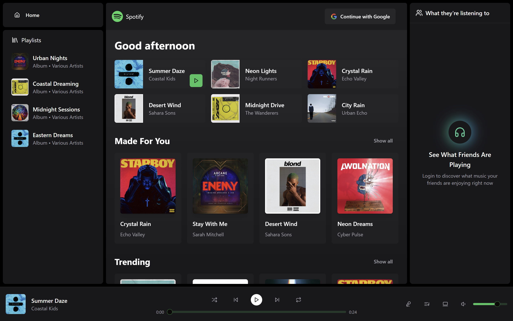

# Realtime Spotify Application ✨

<p align="center">
  
</p>

<p align="center">
  <a href="https://realtime-spotify-clone-ruddy.vercel.app/" target="_blank"><b>Live Demo</b></a> |
  <a href="https://github.com/Hmtgit7/realtime-spotify-clone" target="_blank"><b>Project Repository</b></a>
</p>

---

## 🚀 Overview

A full-featured, real-time Spotify clone built with the MERN stack and modern web technologies. Enjoy seamless music streaming, real-time chat, admin controls, analytics, and more—all in one beautiful application.

---

## ✨ Key Features

- 🎸 Listen to music, play next and previous songs
- 🔈 Volume control with interactive slider
- 🎧 Admin dashboard to create albums and songs
- 💬 Real-time chat integrated into Spotify
- 👨🏼‍💼 Online/Offline user status
- 👀 See what other users are listening to in real-time
- 📊 Analytics dashboard with aggregate data
- 🚀 Lightning-fast, modern UI/UX
- ...and much more!

---

## 🌐 Live Demo

[realtime-spotify-clone-ruddy.vercel.app](https://realtime-spotify-clone-ruddy.vercel.app/)

---

## 🛠️ Getting Started

### 1. Clone the Repository

```bash
git clone https://github.com/Hmtgit7/realtime-spotify-clone.git
cd realtime-spotify-clone
```

### 2. Backend Setup

1. Go to the backend folder:
   ```bash
   cd backend
   ```
2. Install dependencies:
   ```bash
   npm install
   ```
3. Create a `.env` file in the backend folder with the following variables:
   ```env
   PORT=your_port
   MONGODB_URI=your_mongodb_uri
   ADMIN_EMAIL=your_admin_email
   NODE_ENV=development

   CLOUDINARY_API_KEY=your_cloudinary_api_key
   CLOUDINARY_API_SECRET=your_cloudinary_api_secret
   CLOUDINARY_CLOUD_NAME=your_cloudinary_cloud_name

   CLERK_PUBLISHABLE_KEY=your_clerk_publishable_key
   CLERK_SECRET_KEY=your_clerk_secret_key
   ```
4. Start the backend server:
   ```bash
   npm start
   ```

### 3. Frontend Setup

1. Go to the frontend folder:
   ```bash
   cd ../frontend
   ```
2. Install dependencies:
   ```bash
   npm install
   ```
3. Create a `.env` file in the frontend folder with the following variable:
   ```env
   VITE_CLERK_PUBLISHABLE_KEY=your_clerk_publishable_key
   ```
4. Start the frontend app:
   ```bash
   npm run dev
   ```

---

## 📚 Tutorial Roadmap

- Frontend & Auth Setup
- Backend & Database Integration
- Route Protection & Middleware
- Admin, Album, Song, and User Management
- Real-time Features with Socket.io
- Chat, Friends Activity, and Analytics
- Deployment & Final Testing

---

## 🧑‍💻 About Me

Hi, I'm **Hemant Gehlod** ([@Hmtgit7](https://github.com/Hmtgit7)) 👋

I'm a passionate software engineer with a talent for creating elegant solutions to complex problems. My expertise spans both frontend and backend technologies, enabling me to develop scalable applications that deliver exceptional user experiences.

### My Technical Expertise

- **Frontend:** HTML5, CSS3, JavaScript, TypeScript, React, Angular
- **Backend:** Java, Spring, Node.js, Express.js, C++, GraphQL
- **Database:** MongoDB, MySQL, PostgreSQL, Firebase
- **DevOps & Tools:** Git, Docker, Jenkins, AWS, GitHub

### My Current Focus
- Java Enterprise Applications
- Full-stack Shopify Apps
- Cloud-Native Architecture

### Learning
- Advanced DevOps Practices
- Kubernetes Orchestration
- Microservices Architecture

### Looking For
- Open Source Collaborations
- Full Stack Projects
- Technical Mentorship

---

<p align="center">
  <b>Made with ❤️ by Hemant Gehlod</b>
</p>
